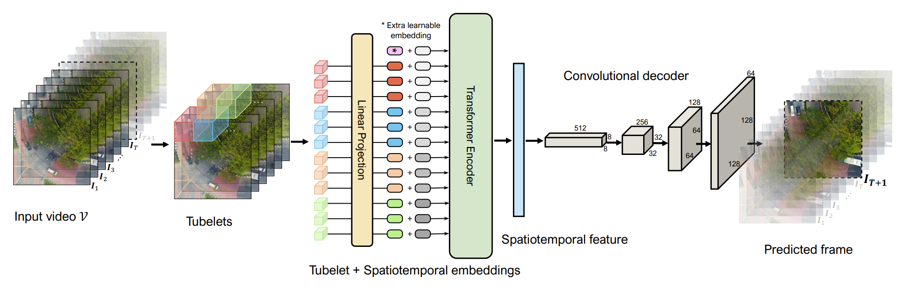

# Drone-Anomaly

## Overview
we create a new dataset, named Drone-Anomaly, for anomaly detection in aerial videos. This dataset provides 37 training video sequences and 22 testing video sequences from 7 different realistic scenes with various anomalous events. There are 87,488 color video frames (51,635 for training and 35,853 for testing) with the size of 640 × 640 at 30 frames per second. Based on this dataset, we evaluate existing methods and offer a benchmark for this task. Furthermore, we present a new baseline model, ANomaly Detection with Transformers (ANDT), which treats consecutive video frames as a sequence of tubelets, utilizes a Transformer encoder to learn feature representations from the sequence, and leverages a decoder to predict the next frame. Our network models normality in the training phase and identifies an event with unpredictable temporal dynamics as an anomaly in the test phase. Moreover, To comprehensively evaluate the performance of our proposed method, we use not only our Drone-Anomaly dataset but also another dataset.


## Dataset

The dataset will be released soon.


## ANDT
We present a new baseline model, ANomaly Detection with Transformers (ANDT), which takes as input several consecutive video frames, leverages a Transformer encoder to model global context, and utilizes a decoder to predict the next frame. More specifically, ANDT treats a video as a sequence of tubelets and maps them into tubelet embeddings by linear projection. For preserving spatiotemporal information, the tubelet embeddings are added with learnable spatiotemporal position embeddings and then fed into a Transformer encoder to learn a spatiotemporal feature. The decoder is subsequently combined with the encoder for predicting the next frame based on the learned spatiotemporal representation. Our network is able to well predict an event with normal temporal dynamics and identifies an event with unpredictable temporal dynamics as an anomaly in the test phase.

## Citation

If you find this project useful in your research, please consider cite:

```BibTeX
@article{jin2022anomaly,  
author={Jin, Pu and Mou, Lichao and Xia, Gui-Song and Zhu, Xiao Xiang},  
journal={IEEE Transactions on Geoscience and Remote Sensing},   
title={Anomaly Detection in Aerial Videos With Transformers},   
year={2022},  
volume={60},  
number={},  
pages={1-13},  
doi={10.1109/TGRS.2022.3198130}
}
```
